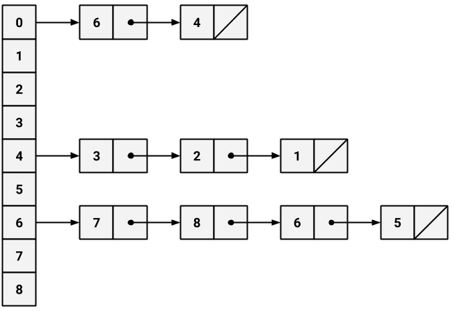

# Assignment 1

## 1a

As a solution representation to this problem, I’ve chosen to use an adjacency list data structure. This involves an array of size N + 1, where N is the number of ports to visit plus one for the starting/home position. Further, each index contains a linked list of ports that are visited explicitly from the given child (see graphical representation below for better understanding). If there is no linked list in a given index in the main array, this means that no port was visited explicitly by a child.

## 1b

# Assignment 2

