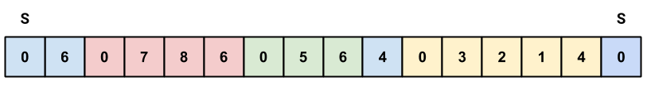
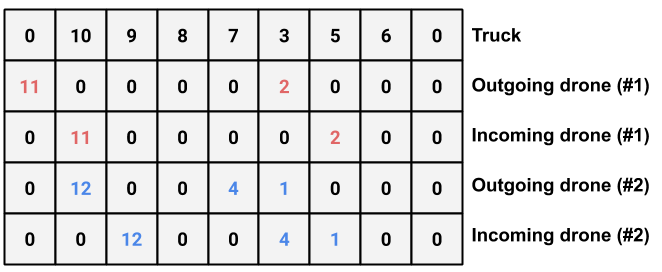

# Mandatory Assignments

The below sections contains my answers to the mandatory assignments in the course INF273 for the spring 2020 semester.

## Assignment 1a

### Alternative 1

As a solution representation to this problem, I’ve chosen to use an adjacency list data structure. This involves an array of size N + 1, where N is the number of ports to visit plus one for the starting/home position.

Further, each index in the main array contains a linked list of ports that are visited explicitly from the node at a given index (see graphical representation below for better understanding). If there is no linked list in a given index in the main array, this means that no port was visited explicitly by a child here (i.e. no subtours were started from here). Note that the example below uses the problem instance from the lecture slides.

### Alternative 2

An even simpler (and possibly a bit better) representation to the problem would be to only use a one dimensional array and have predefined separators for each child tour. For instance, say that we decide upon the value of 0 to be the separator. Now, whenever we visit a node which has a child tour, we insert a separator, and then insert each node in the child tour in order.

Whenever we visist a node that has previously been visisted (cycle), we are done with the child tour. See example below, which uses the problem instance from the lecture slides. All subtours are color coded for readability (main/mother tour is blue).

## Assignment 1b

One possible solution representation for this problem would be to use a matrix. Number of columns in the matrix would be N + 1, where N is the number of nodes visited by the truck (+1 since start is visited two times). The number of rows in the matrix is equal to 1 (truck row) + 2 * the number of drones used by the truck.

Two rows are dedicated to each drone, where the first one contains positions where the drone is outgoing (to serve the customer), and the second row contains positions where the drone is incoming (from the customer). See below matrix for how this looks for the instance in the lecture slide.

Note that if we specify that a given drone only can visit one customer before returning to the truck, we could simplify the matrix to only contain one row for each drone (the row containing the outgoing drones), and have the next node in the main array implicitly be the incoming node.

## Assignment 3

